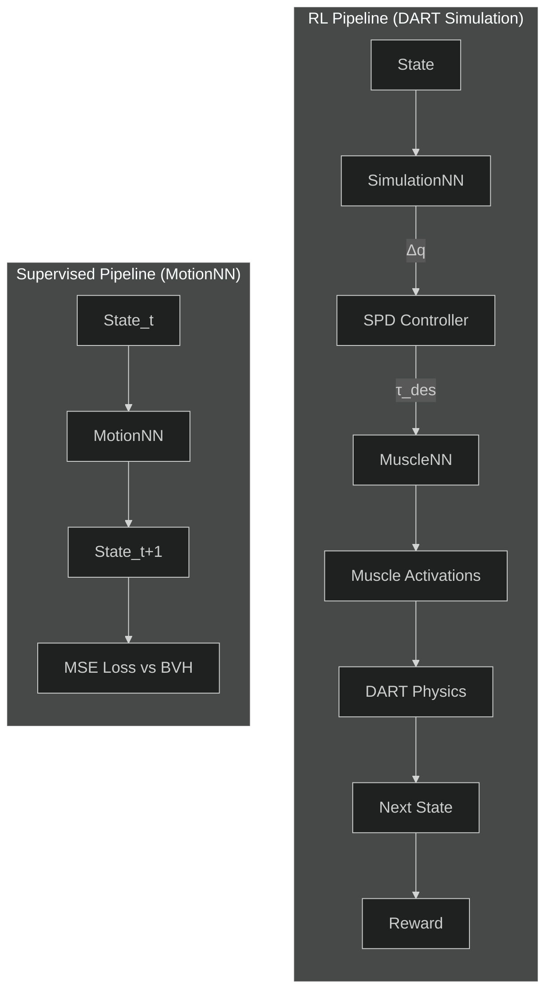

# RL vs Supervised Learning: Architecture Comparison

## Overview



---

## 1. SimulationNN: What Does It Predict?

**Input:** Current state `s` (positions + velocities relative to root)
**Output:** Action distribution → **position offsets (Δq)**

> [!IMPORTANT]
> SimulationNN does NOT output torques directly. The action is a **position offset** that gets added to BVH target positions, then passed through the **SPD controller** to compute joint torques.

```python
# From Model.py
class SimulationNN:
    def forward(self, x):
        # Policy: state → action distribution (Gaussian)
        p_out = MultiVariateNormal(mean, std)
        return p_out, value
```

### The Full Control Flow:

```
SimulationNN → Δq (position offset)
                    ↓
p_des = BVH_target + Δq * 0.1   (Environment.cpp::SetAction)
                    ↓
SPD Controller → τ_des (joint torques)  (Character.cpp::GetSPDForces)
                    ↓
MuscleNN → muscle activations (if using muscles)
                    ↓
Physics simulation
```

**SPD Controller** (from `Character.cpp`):
```cpp
Eigen::VectorXd GetSPDForces(const Eigen::VectorXd& p_desired) {
    // Stable PD: position + velocity damping
    p_diff = -Kp * (q + dq*dt - p_desired);
    v_diff = -Kv * dq;
    tau = p_diff + v_diff - dt*Kv*ddq;
    return tau;
}
```

---

## 2. MuscleNN: What Does It Predict?

**Input:** `JtA` (muscle Jacobian) + `τ_des` (desired torques from SPD controller)
**Output:** **Muscle activation levels** (0 to 1)

```python
# From Model.py
class MuscleNN:
    def forward(self, muscle_tau, tau):
        # Normalize inputs
        muscle_tau = muscle_tau / self.std_muscle_tau
        tau = tau / self.std_tau
        # Output: activation levels
        out = self.fc(torch.cat([muscle_tau, tau], dim=1))
        return out  # 0-1 via Tanh + ReLU
```

**Loss function (from PPO.py):**
```python
# MuscleNN is trained to minimize:
loss_target = ((τ_predicted - τ_des) / 100)²  # Match desired torques
loss_reg = activation²  # Regularize activations
```

---

## 3. MotionNN: What Does It Predict?

**Input:** State_t (or sequence of states)
**Output:** **Next state (State_{t+1})** — positions + velocities

```python
# From motion_nn.py
class MotionNN:
    # s_t → s_{t+1}
    def forward(self, x):
        return predicted_next_state
```

**Loss:** MSE between predicted state and ground truth from BVH

---

## 4. Where Are Rewards Computed?

Rewards are computed in **`core/Environment.cpp`** → `GetReward()`:

```cpp
double Environment::GetReward() {
    // Compare current pose vs BVH reference
    p_diff = skel->getPositionDifferences(mTargetPositions, cur_pos);
    v_diff = skel->getPositionDifferences(mTargetVelocities, cur_vel);
    
    // Reward components:
    r_q = exp(-2.0 * ||p_diff||²)   // Position matching
    r_v = exp(-0.1 * ||v_diff||²)   // Velocity matching
    r_ee = exp(-40.0 * ||ee_diff||²) // End-effector matching
    r_com = exp(-10.0 * ||com_diff||²) // COM matching
    
    return r_ee * (w_q*r_q + w_v*r_v);  // Weighted combination
}
```

**Reward is for the whole agent behavior**, not specifically SimulationNN or MuscleNN outputs. It measures how well the simulated character matches the BVH reference motion.

---

## 5. Key Differences

| Aspect | RL (SimulationNN + MuscleNN) | Supervised (MotionNN) |
|--------|------------------------------|----------------------|
| **Predicts** | Actions (Δq → τ → activations) | Next state |
| **Training signal** | Reward from physics simulation | MSE vs BVH ground truth |
| **Physics** | Uses DART simulation | No physics |
| **Muscles** | Yes (Hill model) | No |
| **Purpose** | Control policy for simulation | Motion prior for pre-training |

---

## 6. Data Flow Summary

### RL Training Loop:
```
s → SimulationNN → Δq → SPD → τ_des → MuscleNN → activations → DART → s' → reward
                                                                  ↓
                                                      Compare with BVH target
```

### Supervised Pre-training:
```
s_t (from BVH) → MotionNN → ŝ_{t+1} → MSE(ŝ_{t+1}, s_{t+1})
                                           ↓
                              No physics, just pattern learning
```

---

## 7. How MotionNN Could Be Used

MotionNN learns **motion dynamics** from BVH data. Potential uses:
1. **Motion prior** during RL (regularize policy)
2. **Warm-start** for policy learning
3. **Reference generator** to replace BVH lookup
4. **State prediction** for model-based RL
